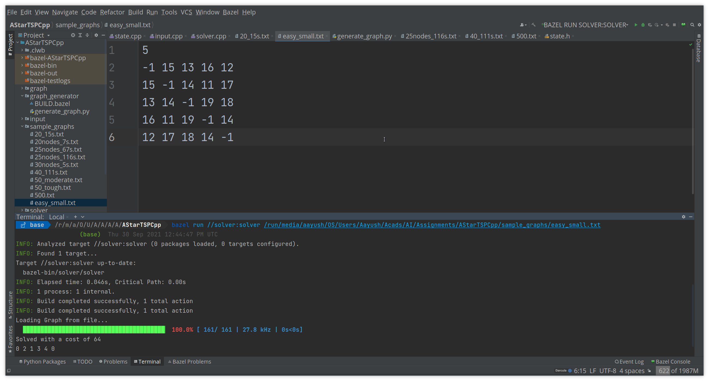
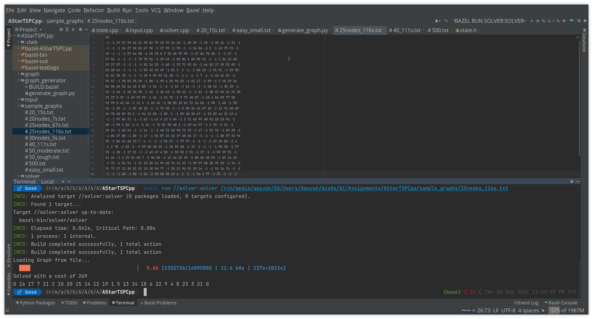
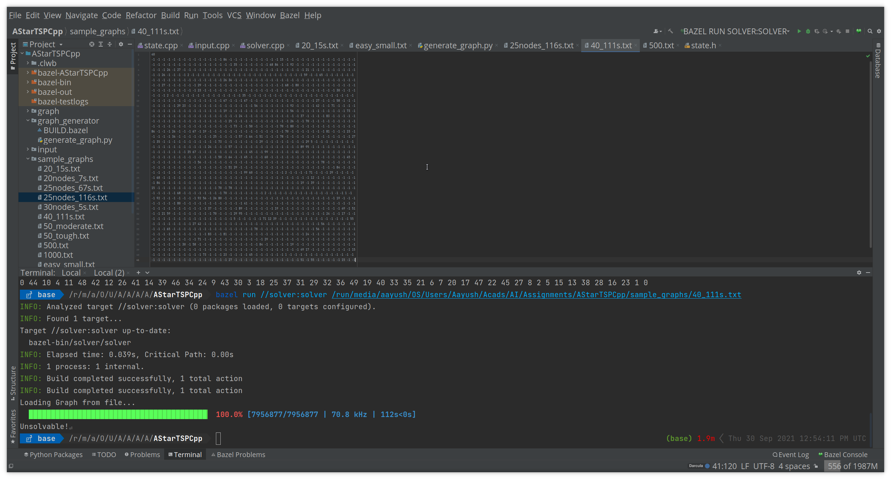
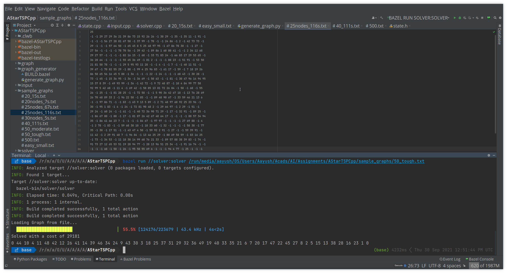
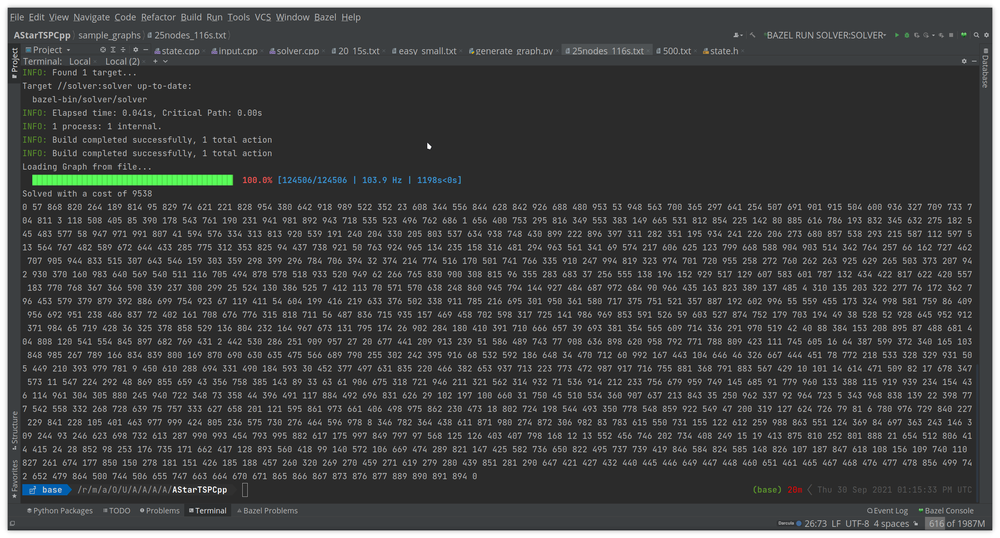

# Solving the Travelling Salesman Problem using A* with Minimum Spanning Tree Heuristic.
## To run
Clone the repo, cd into it, then
```bash
bazel run //solver:solver <path to graph file>
```

Sample Graphs are in the `sample_graphs/`
## Credits
Progress bar adapted from [aminnj/cpptqdm](https://github.com/aminnj/cpptqdm).
## Screenshots





